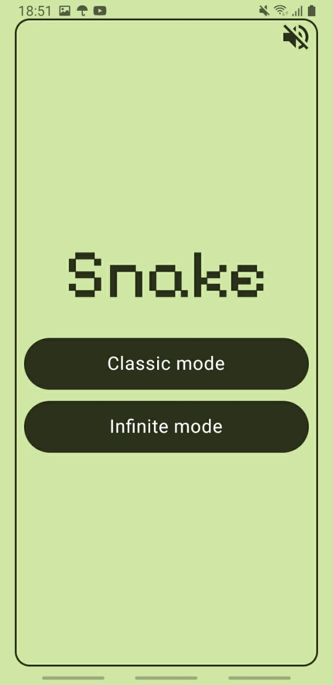
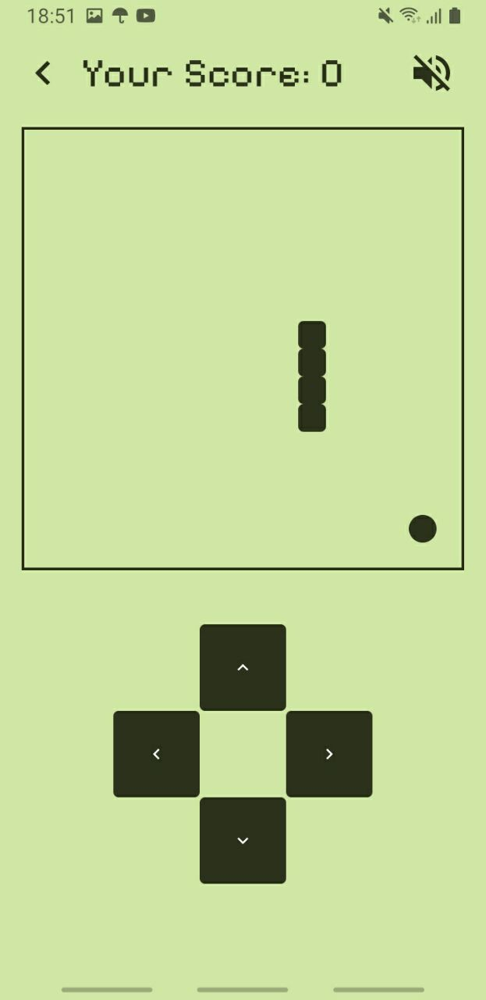
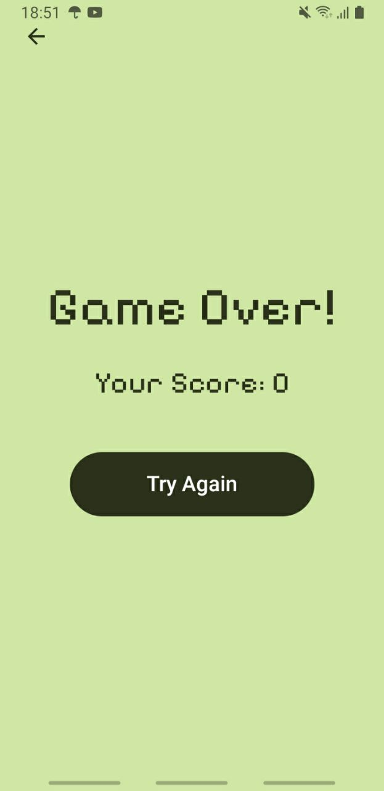

# Snake Game (Jetpack Compose)

A vibrant take on the classic Snake game built entirely with Jetpack Compose. The project ships with two gameplay modes, animated screen transitions, and background music.

## 🎮 Features
- **Two modes:** classic walls mode and endless mode with wrap-around movement.
- **Global sound control:** a single toggle keeps music state in sync across every screen.
- **Smooth navigation:** animated transitions between Home, Game, and Game Over views.
- **Retro aesthetics:** custom pixel-style font and themed visuals.

## 🛠️ Tech Stack
- Kotlin, Jetpack Compose, Material 3
- Navigation / Accompanist Navigation Animation
- MediaPlayer for looping background music

## ▶️ Getting Started
1. Clone the repository or download the archive.
2. Open the project in Android Studio (Electric Eel or newer recommended).
3. Build and run the app on an emulator or physical Android device.

## 📸 Screenshots


| Home | Gameplay | Game Over |
| --- | --- | --- |
|  |  |  |

## 🔊 Sound Controls
- The speaker icon reflects the current global music state on every screen.
- Music can be muted or resumed without restarting the game session.

## 📦 Project Structure
```
app/
 ├── src/main/java/com/example/snakegame
 │   ├── MainActivity.kt        # Entry point that wires MediaPlayer
 │   ├── SoundSettings.kt       # Global sound state holder
 │   └── Screen/                # Home, Game, and GameOver composables
 └── src/main/res               # Resources (drawables, fonts, raw audio, etc.)
```

## 🤝 Contributing
Happy to see community improvements! To propose changes:
1. Fork the repository.
2. Create a feature branch such as `feature/your-feature-name`.
3. Open a pull request describing the changes and attach screenshots if applicable.

## 📄 License
Feel free to use the code for learning or personal projects. For commercial use, make sure to comply with the licenses of bundled fonts and assets.
